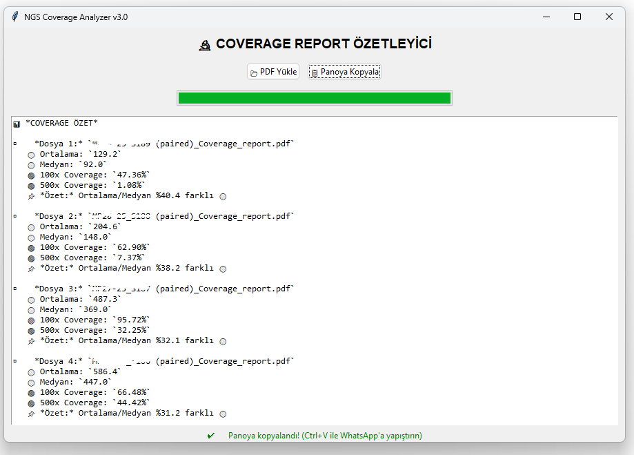

# 🔬 COVERAGE REPORT ÖZETLEYİCİ

NGS parafin blok analizlerinden çıkan PDF raporlarındaki **ortalama, medyan ve coverage** metriklerini otomatik çıkarıp WhatsApp'ta paylaşılabilir özetler oluşturan GUI uygulaması.



## ✨ Özellikler
- **PDF'den Veri Çekme:** Ortalama, Medyan, 100x/500x Coverage
- **Emoji Tabanlı Değerlendirme:** 
  - 🟢 İdeal | 🟡 Orta | 🔴 Riskli
- **WhatsApp Formatında Çıktı:** Tek tıkla panoya kopyalama
- **İlerleme Çubuğu:** Çoklu PDF işlemlerinde gerçek zamanlı takip

## 🛠️ Kurulum
1. Python 3.8+ yüklü olduğundan emin olun.
2. Gerekli kütüphaneleri yükleyin:
   ```bash
   pip install pdfplumber pyperclip
   ```
3. Kodu çalıştırın:
   ```bash
   python coverage.py
   ```

## 🖥️ Kullanım
1. **PDF Yükle** düğmesiyle dosyaları seçin.
2. İşlem tamamlanınca **Panoya Kopyala**'ya tıklayın.
3. WhatsApp'ta `Ctrl+V` yapıp paylaşın.

## 📊 Örnek Çıktı
```text
📊 COVERAGE ÖZET

▫️ Dosya 1: Moleküler-1.pdf
   🟡 Ortalama: 129.2
   🟡 Medyan: 92.0
   🔴 100x Coverage: 47.36%
   🔴 500x Coverage: 1.08%
   📌 Özet: Ortalama/Medyan %40.4 farklı 🟡

▫️ Dosya 3: Moleküler-3.pdf
   🟢 Ortalama: 2588.5
   🟢 Medyan: 2305.0
   🟢 100x Coverage: 99.95%
   🟢 500x Coverage: 99.84%
   📌 Özet: Ortalama/Medyan %12.3 farklı 🟢
```

## 📜 Lisans
MIT License
```
